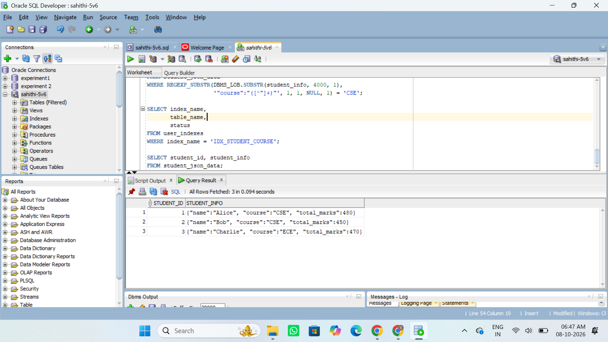
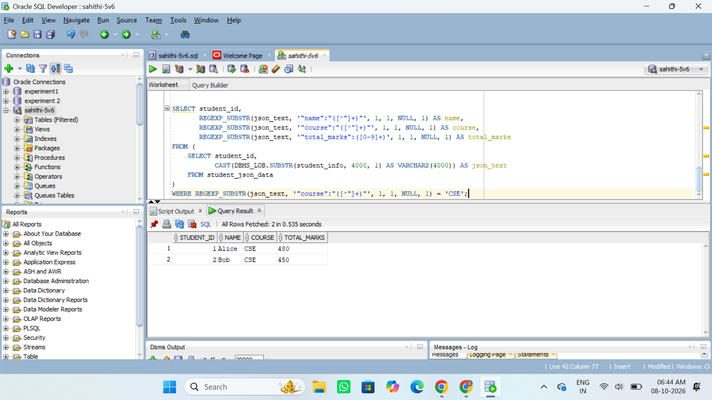
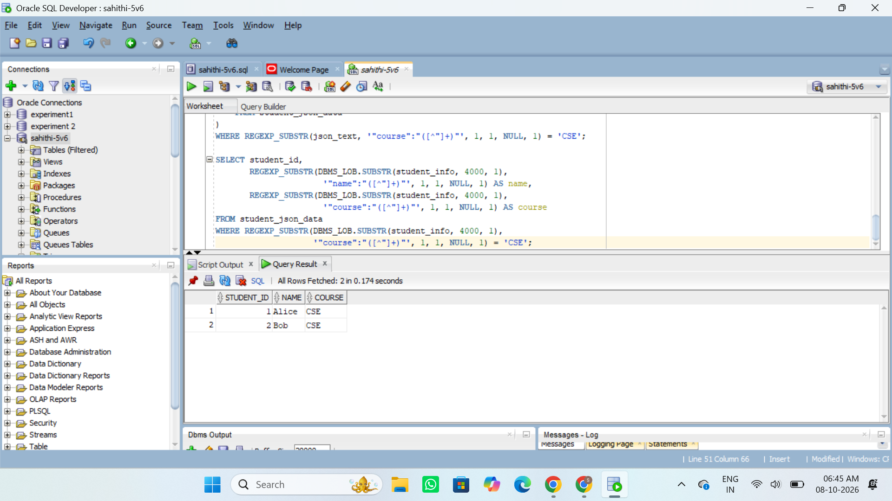
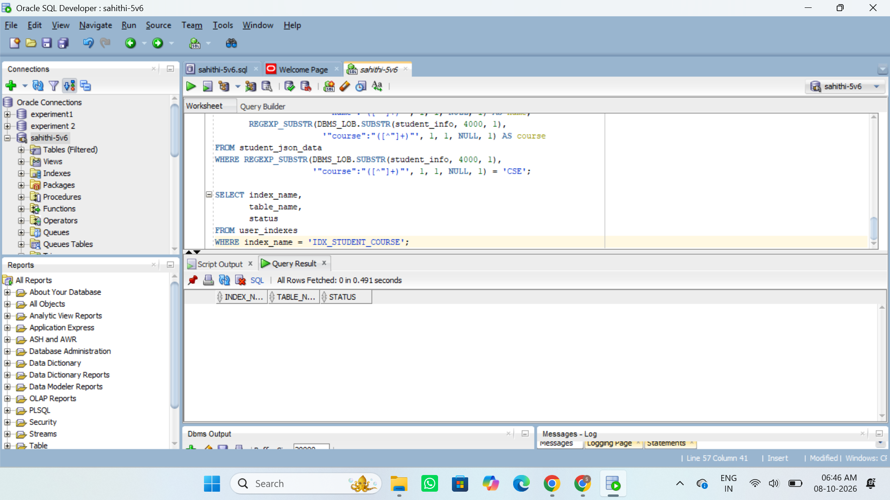

# JSON Data Storage and Functional Indexing in Oracle 11g

## Aim

To store JSON data in an Oracle 11g database using a CLOB column, extract JSON values using REGEXP_SUBSTR, and use a functional index for faster searching.

## 1. Create Table
```
```sql
CREATE TABLE student_json_data (
    student_id NUMBER PRIMARY KEY,
    student_info CLOB
);
INSERT INTO student_json_data (student_id, student_info)
VALUES (1, '{"name":"Alice", "course":"CSE", "total_marks":480}');

INSERT INTO student_json_data (student_id, student_info)
VALUES (2, '{"name":"Bob", "course":"CSE", "total_marks":450}');

INSERT INTO student_json_data (student_id, student_info)
VALUES (3, '{"name":"Charlie", "course":"ECE", "total_marks":470}');

COMMIT;
SELECT student_id, student_info
FROM student_json_data;
```

```
SELECT student_id,
       REGEXP_SUBSTR(DBMS_LOB.SUBSTR(student_info, 4000, 1),
                     '"name":"([^"]+)"', 1, 1, NULL, 1) AS name,
       REGEXP_SUBSTR(DBMS_LOB.SUBSTR(student_info, 4000, 1),
                     '"course":"([^"]+)"', 1, 1, NULL, 1) AS course,
       REGEXP_SUBSTR(DBMS_LOB.SUBSTR(student_info, 4000, 1),
                     '"total_marks":([0-9]+)', 1, 1, NULL, 1) AS total_marks
FROM student_json_data
WHERE REGEXP_SUBSTR(DBMS_LOB.SUBSTR(student_info, 4000, 1),
                    '"course":"([^"]+)"', 1, 1, NULL, 1) = 'CSE';
```

```
CREATE INDEX idx_student_course
ON student_json_data (
    REGEXP_SUBSTR(
        DBMS_LOB.SUBSTR(student_info, 4000, 1),
        '"course":"([^"]+)"',
        1, 1, NULL, 1
    )
);
SELECT student_id,
       REGEXP_SUBSTR(DBMS_LOB.SUBSTR(student_info, 4000, 1),
                     '"name":"([^"]+)"', 1, 1, NULL, 1) AS name,
       REGEXP_SUBSTR(DBMS_LOB.SUBSTR(student_info, 4000, 1),
                     '"course":"([^"]+)"', 1, 1, NULL, 1) AS course
FROM student_json_data
WHERE REGEXP_SUBSTR(DBMS_LOB.SUBSTR(student_info, 4000, 1),
                    '"course":"([^"]+)"', 1, 1, NULL, 1) = 'CSE';
```

```
SELECT index_name,
       table_name,
       status
FROM user_indexes
WHERE index_name = 'IDX_STUDENT_COURSE';
```

