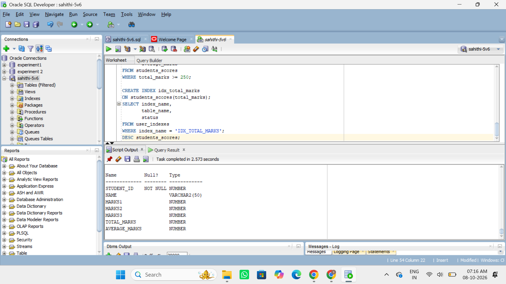
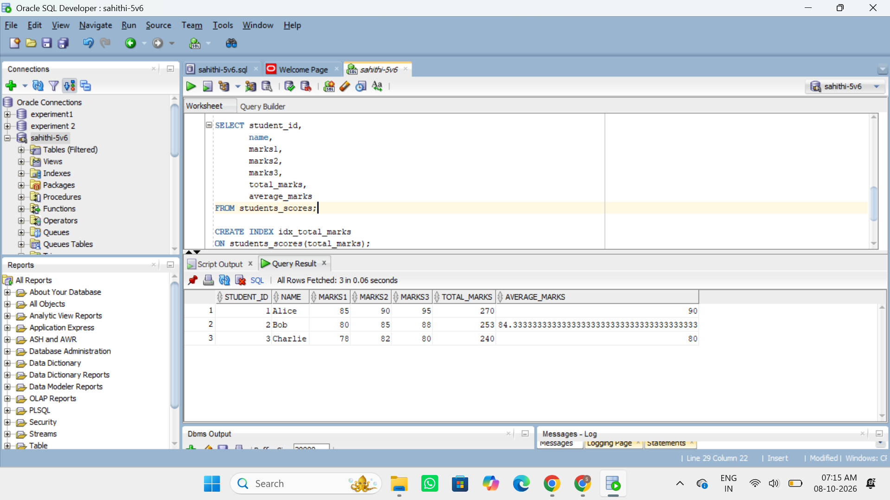
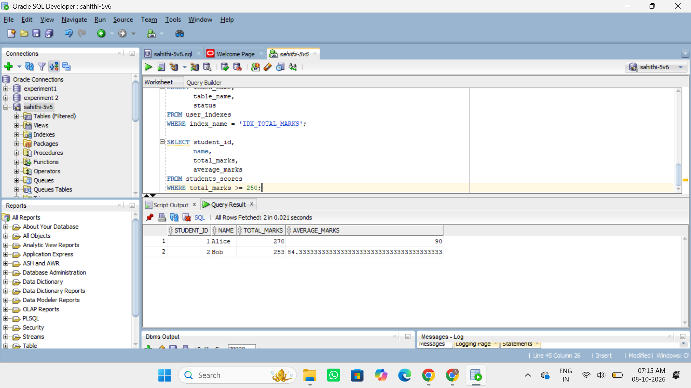
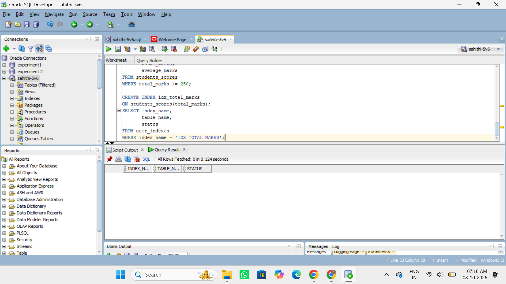

# Virtual Columns in Oracle 11g

Virtual columns are columns that are automatically calculated based on an expression involving other columns in the same table. They are computed automatically and do not require separate values to be inserted.

---

## 1. Create Table with Virtual Columns

```sql
CREATE TABLE students_scores (
    student_id NUMBER PRIMARY KEY,
    name VARCHAR2(50),
    marks1 NUMBER,
    marks2 NUMBER,
    marks3 NUMBER,
    total_marks NUMBER GENERATED ALWAYS AS (marks1 + marks2 + marks3) VIRTUAL,
    average_marks NUMBER GENERATED ALWAYS AS ((marks1 + marks2 + marks3) / 3) VIRTUAL
);
INSERT INTO students_scores (student_id, name, marks1, marks2, marks3)
VALUES (1, 'Alice', 85, 90, 95);

INSERT INTO students_scores (student_id, name, marks1, marks2, marks3)
VALUES (2, 'Bob', 80, 85, 88);

INSERT INTO students_scores (student_id, name, marks1, marks2, marks3)
VALUES (3, 'Charlie', 78, 82, 80);

COMMIT;
DESC students_scores;
```

```
SELECT student_id,
       name,
       marks1,
       marks2,
       marks3,
       total_marks,
       average_marks
FROM students_scores;
```

```
SELECT student_id,
       name,
       total_marks,
       average_marks
FROM students_scores
WHERE total_marks >= 250;
```

```
CREATE INDEX idx_total_marks
ON students_scores(total_marks);
SELECT index_name,
       table_name,
       status
FROM user_indexes
WHERE index_name = 'IDX_TOTAL_MARKS';
```

